# Polyglot Codebase Knowledge Graph

> Generated offline by **readmenator**. Supports C, C++, Python, Go, Rust, JS/TS, Java, C#, Shell, PHP, Dart, GDScript, Nim, ASM.
> No LLMs. No tokens. Pure static analysis. See more [here](https://github.com/grisuno/ReadMenator)

**Total Files Parsed:** 4 | **Total Symbols Extracted:** 15 | **Total Imports:** 7

## Structural Knowledge Map

```mermaid
graph TD
    classDef mod fill:#1e1e1e,stroke:#ff6666,stroke-width:2px,color:#fff;
    classDef cls fill:#2d2d2d,stroke:#4ec9b0,stroke-width:2px,color:#fff;
    classDef fn fill:#333,stroke:#dcdcaa,stroke-width:1px,color:#dcdcaa;
    classDef ext fill:#111,stroke:#666,stroke-dasharray:5 5,color:#aaa;
    header_h["header.h (h)"]
    class header_h mod;
    header_h_HEADER_H["HEADER_H"]
    class header_h_HEADER_H fn;
    header_h --> header_h_HEADER_H
    header_h_log["log"]
    class header_h_log fn;
    header_h --> header_h_log
    main_c["main.c (c)"]
    class main_c mod;
    main_c_get_return_address["get_return_address"]
    class main_c_get_return_address fn;
    main_c --> main_c_get_return_address
    main_c_MySleep["MySleep"]
    class main_c_MySleep fn;
    main_c --> main_c_MySleep
    main_c_fastTrampoline["fastTrampoline"]
    class main_c_fastTrampoline fn;
    main_c --> main_c_fastTrampoline
    main_c_xor32["xor32"]
    class main_c_xor32 fn;
    main_c --> main_c_xor32
    main_c_collectMemPriv["collectMemPriv"]
    class main_c_collectMemPriv fn;
    main_c --> main_c_collectMemPriv
    app_py["app.py (py)"]
    class app_py mod;
    install_sh["install.sh (sh)"]
    class install_sh mod;
    ext_os["os"]
    class ext_os ext;
    app_py -.->|imports| ext_os
    ext_windows_h["windows.h"]
    class ext_windows_h ext;
    header_h -.->|imports| ext_windows_h
    ext_stdio_h["stdio.h"]
    class ext_stdio_h ext;
    header_h -.->|imports| ext_stdio_h
    ext_stdlib_h["stdlib.h"]
    class ext_stdlib_h ext;
    header_h -.->|imports| ext_stdlib_h
    ext_stdint_h["stdint.h"]
    class ext_stdint_h ext;
    header_h -.->|imports| ext_stdint_h
    ext_stdbool_h["stdbool.h"]
    class ext_stdbool_h ext;
    header_h -.->|imports| ext_stdbool_h
    ext_header_h["header.h"]
    class ext_header_h ext;
    main_c -.->|imports| ext_header_h
```

---

## Architecture Reference

### C (1 files)

#### `main.c`
**Path:** `main.c`

**Functions:**
- `get_return_address` (line 2) `static inline UPTR get_return_address(void)` - *include "header.h"*
- `MySleep` (line 18) `static void WINAPI MySleep(DWORD ms)` - *{ #ifdef _WIN64 return (UPTR)__builtin_return_address(0); #else /* 32 bits – también funciona return (UPTR)__builtin_return_address(0); #endif } /*...*
- `fastTrampoline` (line 43) `bool fastTrampoline(bool install, BYTE *target, LPVOID jump, HookTrampolineBuffers *b)` - *b.originalBytesSize = sizeof(g_hookedSleep.sleepStub); /* des-hook temporal fastTrampoline(false, (BYTE*)Sleep, (LPVOID)MySleep, &b); Sleep(ms); if...*
- `xor32` (line 93) `void xor32(uint8_t *buf, SIZE_T sz, uint32_t key)` - *memcpy(target, b->originalBytes, b->originalBytesSize); size = b->originalBytesSize; } typeNtFlushInstructionCache fn; fn = (typeNtFlushInstruction...*
- `collectMemPriv` (line 104) `static void collectMemPriv(void)`
- `initializeShellcodeFluctuation` (line 131) `void initializeShellcodeFluctuation(LPVOID caller)` - *(mbi.Protect & (PAGE_EXECUTE_READWRITE|PAGE_EXECUTE_READ|PAGE_READWRITE)) ) { if (used == alloc) { alloc = alloc ? alloc*2 : 64; g_memMap = realloc...*
- `isShellcodeThread` (line 159) `bool isShellcodeThread(LPVOID addr)` - *g_fluctuationData.shellcodeSize = m->RegionSize; g_fluctuationData.currentlyEncrypted = false; g_fluctuationData.encodeKey = ((uint32_t)rand()<<16)...*
- `shellcodeEncryptDecrypt` (line 169) `void shellcodeEncryptDecrypt(LPVOID caller)` - *ExitProcess(0); } /* ------------- es thread shellcode? -- bool isShellcodeThread(LPVOID addr) { MEMORY_BASIC_INFORMATION mbi; if (!VirtualQuery(ad...*
- `VEHHandler` (line 207) `LONG NTAPI VEHHandler(PEXCEPTION_POINTERS xp)` - *VirtualProtect(g_fluctuationData.shellcodeAddr, g_fluctuationData.shellcodeSize, PAGE_NOACCESS, &old); log("[>] Flipped to NoAccess"); } else if (g...*
- `readShellcode` (line 230) `bool readShellcode(const char *path, uint8_t **out, SIZE_T *outSize)` - *#endif log("[.] AV at 0x%p", (void*)ip); UPTR base = (UPTR)g_fluctuationData.shellcodeAddr; UPTR end  = base + g_fluctuationData.shellcodeSize; if ...*
- `runShellcode` (line 244) `static DWORD WINAPI runShellcode(LPVOID param)` - *bool readShellcode(const char *path, uint8_t **out, SIZE_T *outSize) { HANDLE h = CreateFileA(path,GENERIC_READ,FILE_SHARE_READ,NULL, OPEN_EXISTING...*
- `injectShellcode` (line 249) `bool injectShellcode(uint8_t *sc, SIZE_T scSize, HANDLE *outThread)`
- `main` (line 264) `int main(int argc, char **argv)` - *bool injectShellcode(uint8_t *sc, SIZE_T scSize, HANDLE *outThread) { void *mem = VirtualAlloc(NULL,scSize,MEM_COMMIT,PAGE_READWRITE); if (!mem) re...*

### H (1 files)

#### `header.h`
**Path:** `header.h`

**Macros:**
- `HEADER_H` (line 2)
- `log` (line 48)

### PY (1 files)

#### `app.py`
**Path:** `app.py`

*No symbols extracted*

### SH (1 files)

#### `install.sh`
**Path:** `install.sh`

*No symbols extracted*
